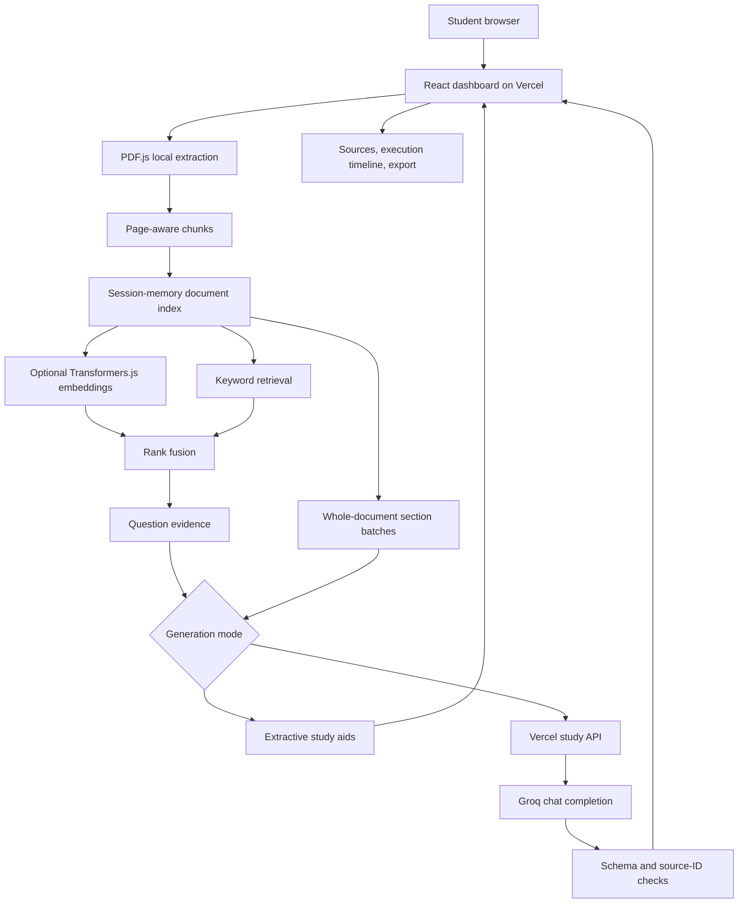

# High-Level Design

## Objective

Provide a source-linked study workspace that converts a learner's PDF into notes, mind maps, recall practice and revision materials, while exposing document preparation and retrieval measurements.

## Architecture

## Main flows

### Ingestion

Validate size and PDF signature, load the document, extract each page and warn about pages with little text. Split each readable page into word-based chunks with overlap. Preserve PDF page numbers. Store chunks in React memory. No original file is sent to the server.

### Question answering

Rank the current document using BM25. When semantic search is enabled, embed the query locally and fuse keyword and cosine-similarity ranks with reciprocal rank fusion. Select up to five deduplicated passages. Extractive mode displays passages; AI mode sends passages and question to the protected server endpoint. Display answer and source buttons.

### Whole-document tools

Walk every readable chunk and build approximately 10,000-character batches. Generate each batch sequentially and concatenate source-linked outputs. This avoids pretending a small top-K retrieval set covers an entire book. Current large-document outputs are section collections; there is no global synthesis pass or cross-section prerequisite inference.

## Trust and deployment boundaries

Browser holds PDF object URLs, text, vectors, results and access token. Vercel serves static assets and stateless API functions. The API validates an access token and request contracts, calls Groq with a server secret, and validates the model response. No server-side persistence is required for the MVP.

AI evidence is transmitted to Vercel and Groq. Optional semantic setup downloads public model files from Hugging Face. Files are local, but AI-mode content is not entirely local.

## Technology decisions

| Decision | Reason | Tradeoff |
|---|---|---|
| React + Vite instead of Streamlit | Flexible dashboard and direct Vercel frontend deployment | More UI code |
| PDF.js browser extraction | Page references and no file upload service | Browser resource limits, no OCR |
| In-memory index instead of Qdrant | Simple private single-document prototype | Refresh loses state; not a persistent enterprise vector database |
| BM25 baseline | Immediate operation without model download | Weak cross-language and paraphrase retrieval |
| Optional multilingual E5 | Semantic and cross-language search locally | Initial download and CPU/memory costs; Tamil ranking weak in the small fixture |
| Groq server endpoint | Keep key private, generate structured study items | Provider dependency and token cost |
| Zod output validation | Reject malformed output and invalid source IDs | Does not prove factual support |

## Future enterprise evolution

Add identity, tenant-scoped storage, object storage, ingestion jobs, OCR, Qdrant with tenant/document filters, reranking, provider budgets, rate limits, retention controls and broader teacher-reviewed evaluation. These are planned changes, not current features.
